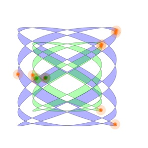

# Lissajous Curves
Draws, rotates and then undraws(traces back the draw) lissajous curves. 
   

View live demo at : https://codepen.io/niitettehtsuru/pen/ZEbeoPy
 
## Getting Started

These instructions will get you a copy of the project up and running on your local machine for development and testing purposes. 

### Prerequisites

All you'll ever need is a working web browser. That's it.

### Installing
Open the index.html file in your web browser. It's that simple.  
 
## Built With

* Pure Javascript.  

## Authors 

* **Caleb Nii Tetteh Tsuru Addy**   
 
## License

This project is licensed under the GNU General Public License v3.0.
